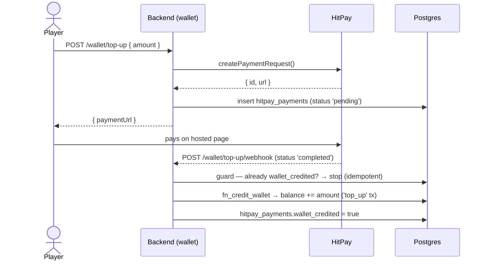
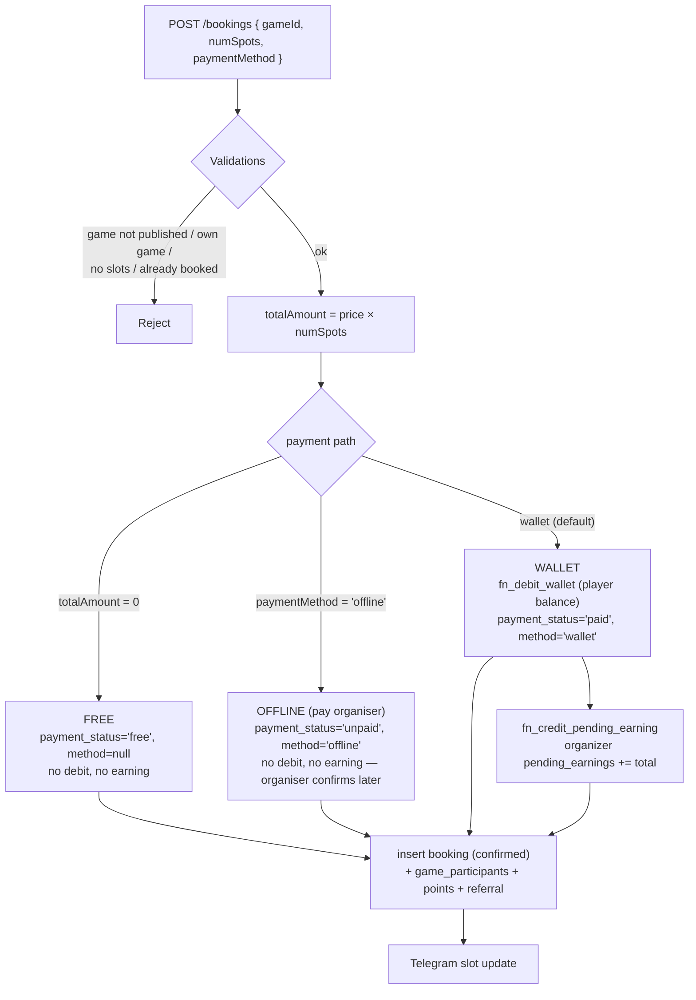
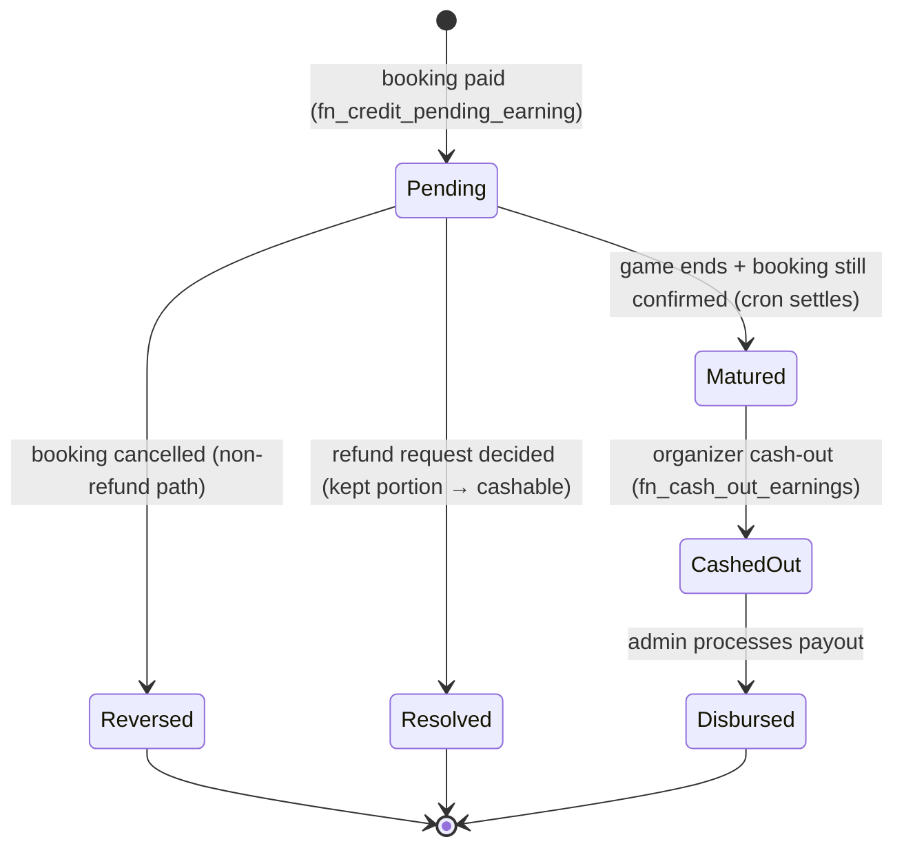
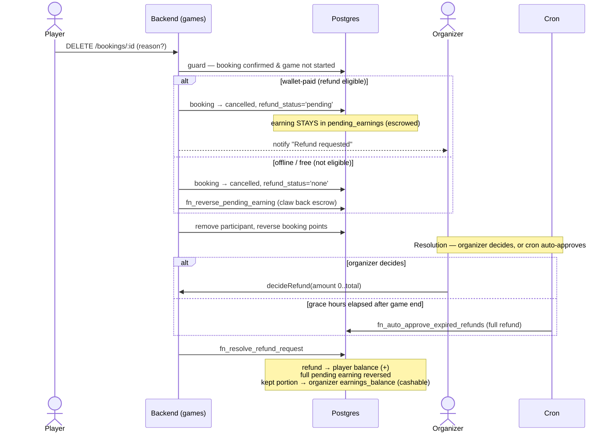
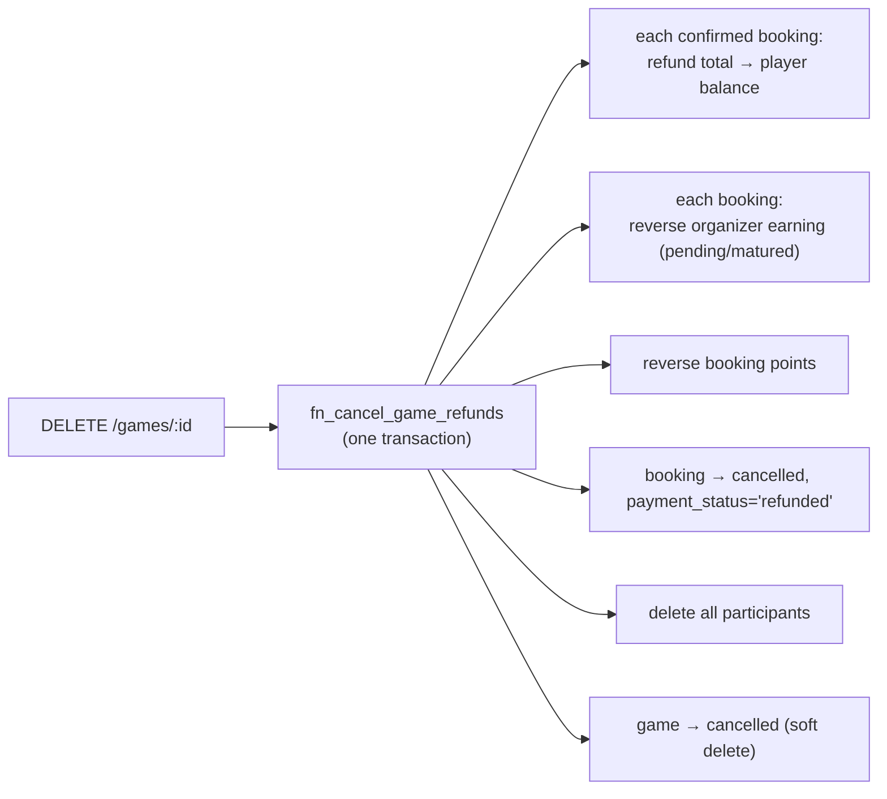
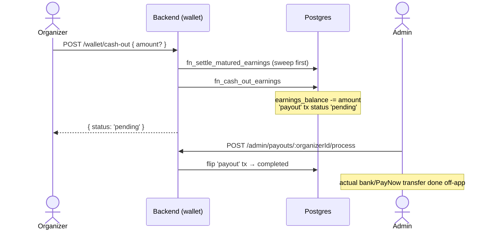

# Escrow Payment Flow (Current System)

> **Status:** As-built — reflects the code on `backend` today.
> **Model:** *Escrow-until-game-ends*. The platform never fronts money; a player pays,
> the organizer's earning is held in escrow until the game finishes, then becomes cashable.
> This is the default flow for **every organizer** and the counterpart to
> [Instant-Payout-Payment-Flow.md](./Instant-Payout-Payment-Flow.md) (trusted organizers).
>
> Diagrams are [Mermaid](https://mermaid.js.org/) (render in GitHub / VS Code).

---

## 1. The money model

```
top-up ──▶ balance ──(book)──▶ organizer pending_earnings ──(game ends)──▶ earnings_balance ──▶ payout
 (HitPay)  (spendable)          (escrow, not cashable)        (cron)        (cashable)          (admin)
```

Real cash always sits in the platform's payment processor (HitPay) / bank. The wallet
tables are an **internal liability ledger** — booking a game just moves a liability from
"owed to player" to "owed to organizer". `wallet_transactions` is append-only and is the
source of truth; the balance columns are atomically-maintained caches.

### Wallet buckets (`wallets` row per user)

| Bucket | Column | Meaning | Cashable? |
|---|---|---|---|
| Spendable | `balance` | Top-ups, refunds, redeemed points — used to book | No, spend-only |
| Pending earnings | `pending_earnings` | Organizer earnings held in escrow until game ends | No |
| Earnings | `earnings_balance` | Matured earnings, ready to cash out | Yes |

---

## 2. Top-up (HitPay)



- Idempotent on the `wallet_credited` flag — duplicate webhooks never double-credit.
- Legacy `POST /wallet/top-up` (dev/manual) credits directly via `fn_credit_wallet`.
- `redeemPoints` is a sibling: deduct points → `fn_credit_wallet` (`points_redemption`).

---

## 3. Booking — `createBooking`



Key rules enforced before charging: game `published`, not the organizer's own game, slot
availability (public / community / hybrid pools), no duplicate confirmed booking, ≤10 spots.
If the booking `insert` fails **after** a wallet debit, the debit is auto-refunded.

**Only `wallet`-paid bookings move money through Activ8**, so only those credit the
organizer's escrow. Offline and free bookings credit nothing.

---

## 4. Escrow earnings lifecycle



- **Settlement** runs every 15 min (`fn_settle_all_matured_earnings`) and lazily on any
  earnings read (`fn_settle_matured_earnings`). It sweeps `game_earning` rows that are
  still `pending`, whose booking is `confirmed`, and whose `end_datetime < NOW()` —
  moving the amount `pending_earnings → earnings_balance`, then notifies the organizer.
- The cron runs **auto-approve of expired refund requests first**, so contested bookings
  are reversed, not matured.

---

## 5. Player cancels — refund-request lifecycle



`refund_status`: `none` → `pending` → `approved` / `denied`.
`fn_resolve_refund_request` clamps the refund to `[0, total]`: the **refunded** part goes
back to the player's `balance`, the **kept** part (`total − refund`) is credited to the
organizer's cashable `earnings_balance`, and the original pending earning is reversed —
so the kept-vs-refunded split is decided atomically in one place.

---

## 6. Organizer cancels the whole game



Full refunds to every player and a full reversal of the organizer's earnings, atomically.

---

## 7. Cash-out & disbursement



`earnings_balance` is debited at cash-out time; admin processing only flips the ledger
status. Real money-out (bank / PayNow) is manual.

---

## 8. Cron responsibilities (`app.js`, every 15 min)

1. **Auto-approve expired refunds** (`fn_auto_approve_expired_refunds`) — full refund for
   pending requests the organizer never decided, once the game has been over for
   `refund_request_grace_hours`. Runs **before** settlement.
2. **Settle matured earnings** (`fn_settle_all_matured_earnings`) — `pending → cashable`
   for finished games, then notify each organizer "earnings available".

(Daily jobs prune old notifications — not payment-related.)

---

## 9. Payment-method matrix

| Method | Player debit | `payment_status` | Organizer earning | Refund on cancel |
|---|---|---|---|---|
| **wallet** (default) | Yes (`balance`) | `paid` | `pending_earnings` (escrow) | Refund request → resolved |
| **offline** (pay organiser) | No | `unpaid` | None | None (seat freed) |
| **free** (price 0) | No | `free` | None | None (seat freed) |

---

## 10. Ledger transaction types (`wallet_transactions.type`)

| Type | Bucket touched | When |
|---|---|---|
| `top_up` | `balance` +| HitPay / manual top-up |
| `booking_payment` | `balance` − | Player books (wallet) |
| `refund` | `balance` + | Cancellation / failed booking / game cancelled |
| `points_redemption` | `balance` + | Redeem points for credit |
| `game_earning` | `pending_earnings` + (then `earnings_balance` on maturity) | Player books a paid game |
| `earning_reversal` | reverses `game_earning` | Booking/game cancelled |
| `payout` | `earnings_balance` − | Cash-out (awaiting disbursement) |
