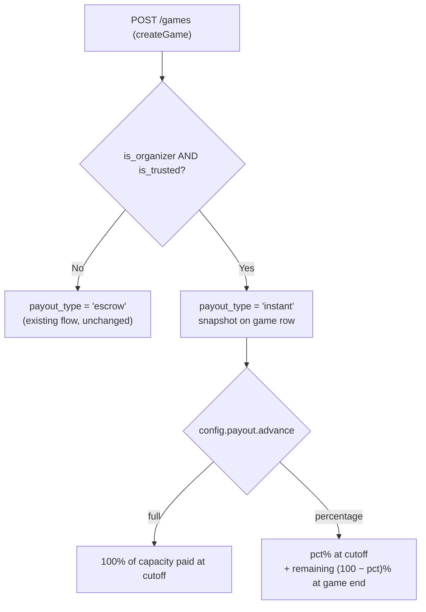
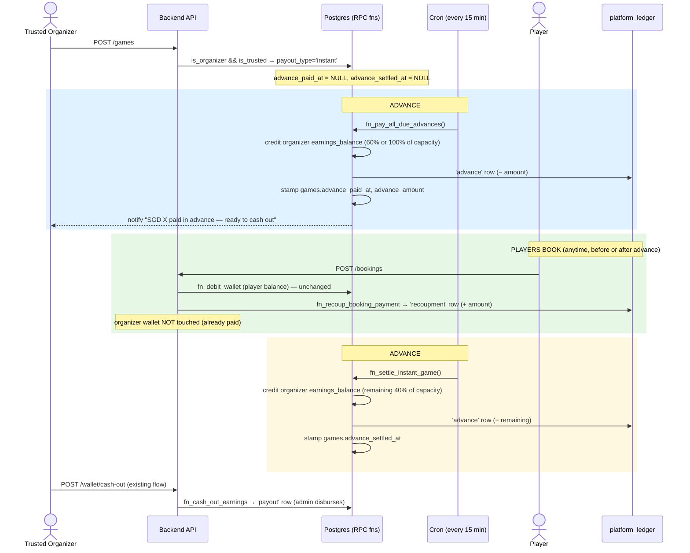
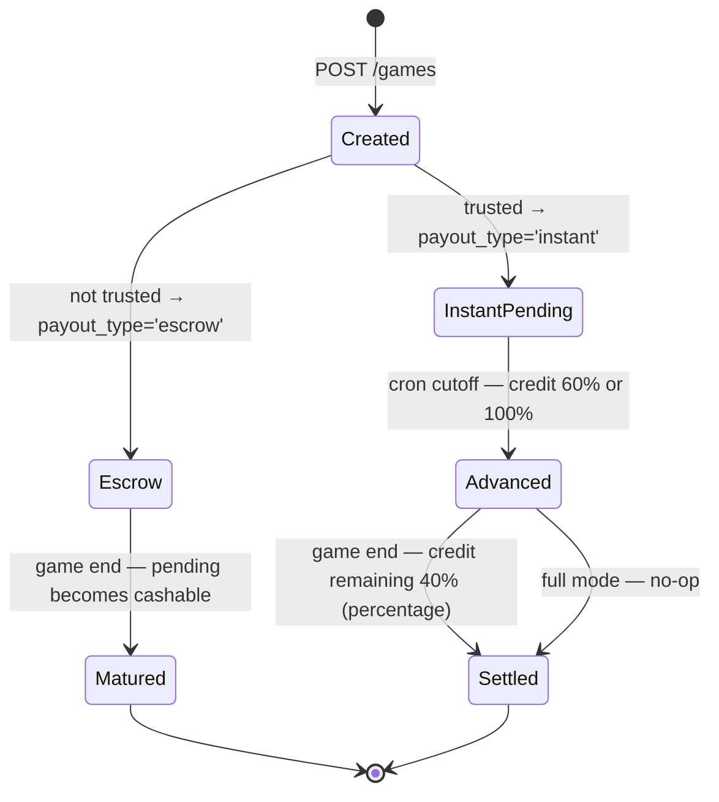

# Instant Payout — Payment Flow (Trusted Organizers)

> **Status:** Design / pre-implementation spec.
> **Scope:** Backend only. **No Flutter changes required** — players and organizers
> use the app exactly as today; only the *destination* of the money changes server-side.
>
> Diagrams below are [Mermaid](https://mermaid.js.org/) (renders on GitHub & VS Code).
> The rest of this folder uses `.drawio`; this flow is text-based so it diffs cleanly
> and stays in sync with the code.

---

## 1. Why this exists

Today Activ8 runs **one** money model — *escrow*: a player pays, the money is held in the
organizer's `pending_earnings`, matures into cashable `earnings_balance` when the game
ends, and the organizer cashes out. The platform never fronts money.

**Instant Payout** adds a **second, parallel model** for organizers who are both
`is_organizer` **and** `is_trusted`. The platform effectively **buys the game's inventory
upfront and resells the seats**:

- The platform **pays the organizer in advance** (before/independent of bookings).
- When players later book, their money is **kept by the platform** (to recoup the advance)
  and is **never credited to any organizer wallet** — the organizer was already paid.

The two models coexist. Which one a game uses is decided **once, at creation**, and
snapshotted on the game row so later trust changes never affect money already in flight.

---

## 2. Accounts & buckets

| Account | Where | Holds |
|---|---|---|
| Player **spendable** | `wallets.balance` | Top-ups; debited on booking |
| Organizer **pending** (escrow only) | `wallets.pending_earnings` | Escrowed earnings until game ends |
| Organizer **cashable** | `wallets.earnings_balance` | Matured earnings **and instant advances** — cashable now |
| **Platform house account** | `platform_ledger` *(new table)* | Advances paid out (−), player money recouped (+), refunds absorbed (−) |

> The platform account is a **ledger, not a wallet** — this is the "held in our system,
> not credited to any wallet" money you described. Per-game P&L = `SUM(amount)` for that
> `game_id`; negative = the platform lost money on that game (under-booked).

---

## 3. Per-organizer configuration

`is_trusted` (migration `101`, already live) gates **whether** a game is instant.
A new `config JSONB` column on `profiles` (migration `102`) controls **how much** and
**how soon**, per organizer:

```jsonc
{
  "payout": {
    "advance": "full",          // "full" = 100% upfront | "percentage" = split
    "advancePercentage": 60,     // used when advance = "percentage"
    "delayDays": 3               // optional per-organizer override of the global X
  }
}
```

- Global default delay `X` → `admin_config.instant_payout_delay_days`.
- Empty `config` (`{}`) + trusted ⇒ sane defaults (treat as `full`, global `X`).
- `config` is a generic settings bag — future organizer settings go here, no schema churn.

---

## 4. Decision at game creation



`capacity = max_slots × price_per_player` (the full potential revenue).
`payout_type` is **snapshotted** at creation — flipping trust later does not retro-change it.

---

## 5. Instant payout — end-to-end sequence



> **"Instant" = the advance lands in the organizer's cashable `earnings_balance`
> immediately at the cutoff** (instead of waiting for the game to end). Actual
> money-to-bank still runs through the existing cash-out → `admin/payouts` disbursement.
> Fully-automated bank disbursement (HitPay Payouts API) is a separate future item.

---

## 6. Game payout lifecycle (state)



---

## 7. Worked example (percentage mode, 60/40)

Capacity: `10 slots × SGD 10 = SGD 100`. Organizer config: `advance: percentage, 60%`.

| Event | Organizer `earnings_balance` | `platform_ledger` | Platform net (this game) |
|---|---|---|---|
| Advance #1 (cutoff) | +60 | −60 (advance) | −60 |
| Player books 7 seats | — | +70 (recoupment) | +10 |
| Advance #2 (game end) | +40 | −40 (advance) | −30 |
| **Totals** | **100** | **−30** | **−30 (loss, under-booked)** |

If the game sells out (10 × 10 = 100 recouped) the platform nets **0**. The platform
absorbs the shortfall on under-booked games — this is the risk it takes on for trusted
organizers, settled/monitored via `platform_ledger`.

---

## 8. Edge cases & policy

| Case | Behaviour |
|---|---|
| **Player cancels** (game still on) | Player refunded **from the platform** (`platform_ledger` 'refund', −). Organizer keeps the advance. Platform absorbs. No clawback. |
| **Organizer cancels the whole game** *after* advance paid | Platform **keeps** all recouped player money, refunds players from platform funds, and **settles the advance with the organizer offline** (manual). No automated clawback. Repeat offenders → future blacklist. |
| **Organizer cancels** *before* advance paid | No advance yet → nothing to reverse; normal cancellation. |
| **Under-booking** | Platform absorbs the gap (see §7). Visible as negative net in `platform_ledger`. |
| **Trust revoked after creation** | In-flight games keep `payout_type` from their snapshot; only *new* games become escrow. |
| **Offline ('pay organiser') bookings** | Unchanged — no money moves through Activ8, no recoupment row. |

---

## 9. Backend implementation checklist

**Migrations** (`backend/migrations/`)
- `102_add_config_to_profiles.sql` — `config JSONB NOT NULL DEFAULT '{}'` (+ rollback).
- `103_add_payout_type_to_games.sql` — `payout_type`, `advance_paid_at`, `advance_amount`, `advance_settled_at` + partial index (+ rollback).
- `104_create_platform_ledger.sql` — table, indexes, service-only RLS (+ rollback).
- `105_instant_payout_functions.sql` — `fn_pay_game_advance`, `fn_pay_all_due_advances`, `fn_recoup_booking_payment`, `fn_settle_instant_game`; extend `fn_cancel_game_refunds` for the instant path; add `'game_advance'` to the `wallet_transactions` type check (+ rollback).

**Services**
- `services/wallet-ops.service.js` — thin wrappers: `payGameAdvance`, `recoupBookingPayment`, `settleInstantGame`.
- `plugins/games/service.js`
  - `createGame`: stamp `payout_type = (is_organizer && is_trusted) ? 'instant' : 'escrow'`.
  - `createBooking`: for `payout_type='instant'`, call `recoupBookingPayment` **instead of** `creditPendingEarning`; player debit unchanged.
  - cancellation/refund paths: route instant-game refunds through the platform.

**Cron** (`backend/src/app.js`)
- Extend the 15-min job: pay due advances (`fn_pay_all_due_advances`, notify) and, at game end, top up percentage-mode remainders (`fn_settle_instant_game`). Escrow settlement untouched.

**Admin**
- Endpoint to set `is_trusted` and write `config.payout`.
- Surface `platform_ledger` net exposure (per game + aggregate) in the admin payouts view.

**Flutter** — **no changes.**

---

## 10. Settled decisions

1. **Percentage split** = *X% of capacity now, remaining (100−X)% of capacity at game end* — a fixed split on capacity, **not** tied to how many players actually booked.
2. **Whole-game cancellation after advance** = platform keeps the money, **settles with the organizer offline**; no automated clawback (future: blacklist).
3. **Player refunds** = platform absorbs.
4. **Timing** = `LEAST(created_at + X days, start_datetime)`.
5. **Scope** = automatic for every game by a trusted organizer.
6. **Frontend** = unchanged.
